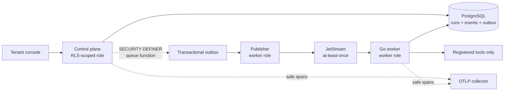

# Architecture

## Runtime path

`API -> PostgreSQL transaction/outbox -> JetStream -> Go worker -> registered tool/model -> PostgreSQL event/audit -> OpenTelemetry`

PostgreSQL is the durable source of truth for tenants, principals, workflow
versions, runs, step attempts, approvals, idempotency records, budgets, and the
transactional outbox. JetStream provides at-least-once task delivery. Redis is
limited to quota and lease acceleration; losing Redis must not lose a run.

The first migration lives in `db/migrations/0001_runtime.sql`. It scopes every
runtime row to a tenant and enables PostgreSQL RLS for workflow, run, event,
effect, approval, outbox, and audit tables. The control plane must set
`app.tenant_id` inside every transaction; RLS is a second boundary, not a
replacement for explicit query predicates.

The outbox publisher is a system component and uses a separate worker database
credential. It is never exposed through tenant-facing HTTP APIs. It locks a
bounded batch, publishes each message to JetStream, then marks that batch
published. A failure between those two operations causes safe redelivery; the
message is not treated as exactly-once.

## Correctness boundary

The worker may execute a task more than once. Every tool invocation receives a
stable `(tenantId, runId, stepId, effectKey)` and commits through an idempotency
record. The runtime therefore guarantees no duplicate **committed** external
effect for an equivalent key; it does not claim impossible global exactly-once
execution.

## Run state machine and recovery

```mermaid
stateDiagram-v2
  [*] --> queued: committed run + outbox
  queued --> leased: worker claim
  leased --> running: durable start record
  running --> awaiting_approval: approval step
  awaiting_approval --> queued: approved; next step only
  queued --> cancelled: cancellation
  leased --> queued: lease expires before durable work
  running --> queued: read-only interruption after lease expiry
  running --> uncertain: ambiguous side effect or credential loss
  running --> failed: deterministic validation/tool failure
  running --> succeeded: all steps recorded
  awaiting_approval --> cancelled: cancellation
  succeeded --> [*]
  failed --> [*]
  cancelled --> [*]
  uncertain --> [*]
```

An expired lease is eligible for one new claim. A crash before an idempotent
effect ledger commit can retry after expiry; an interruption at an ambiguous
effect boundary is recorded as `uncertain` rather than blindly retried.

## Workflow v1

Definitions are immutable and linear. Each step is one of `model`, `transform`,
`tool`, or `approval`. Server-side tool registration controls permissions and
egress. Approval is required before configured side-effecting tools can run.

## Observability and secrets

When `OTEL_EXPORTER_OTLP_ENDPOINT` is configured, every control-plane request
and worker run/step emits a trace. Logs and trace attributes contain identifiers,
durations, outcomes, and redacted error classes, never provider keys or raw
secret-bearing prompts/tool input. The console displays redacted event evidence.
