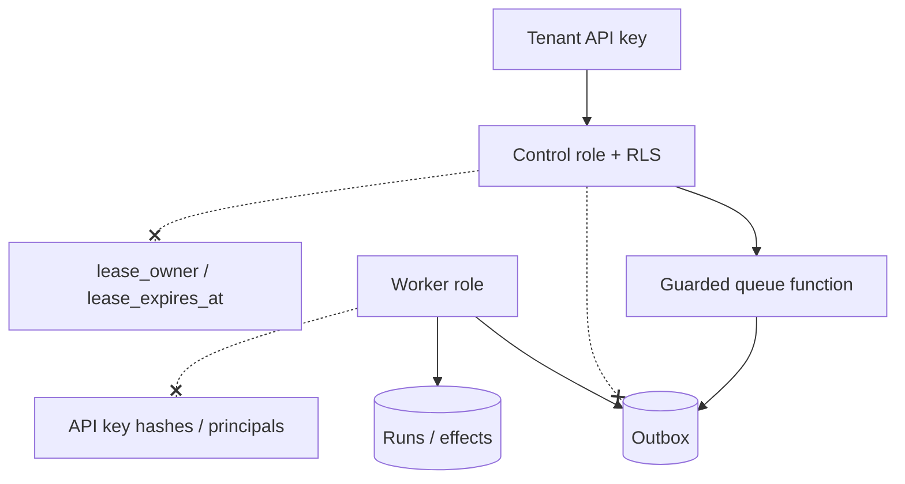

# Threat model

| Threat | Control |
| --- | --- |
| Cross-tenant read/write | Tenant identity is required on every repository operation; tests exercise both directions. |
| Duplicate tool effect after retry | Stable effect keys, transactional idempotency records, and no blind retry after uncertain completion. |
| Provider-key exposure | Per-run memory-only credential, header/body redaction, secret scanner fixtures, and no key persistence. |
| Prompt/tool instruction injection | Workflow definitions are trusted configuration; model/tool data remains untrusted and cannot register tools or alter policy. |
| Arbitrary code or network execution | Only server-registered tools; allowlisted HTTP destinations; no shell/browser tool in v1. |
| Cost exhaustion | Per-tenant budget ledger, quotas, cancellation, and hard pre-dispatch checks. |
| Queue or worker failure | Durable outbox, leased tasks, heartbeats, recovery, and explicit uncertain state. |

## Trust boundaries

The local role passwords are fixtures only. Deployment replaces them with
externally managed secrets while preserving the same grants and RLS policies.
